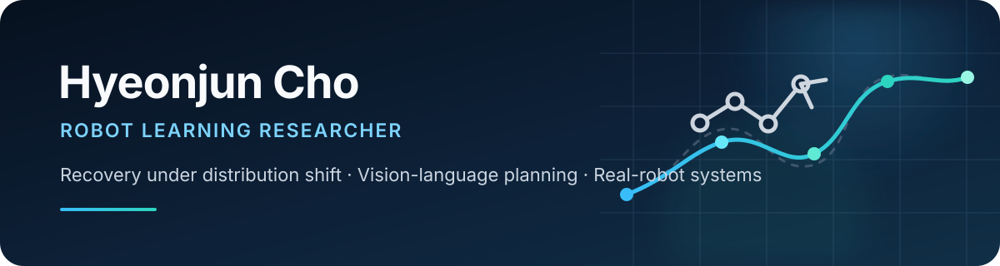

  

  <strong>Undergraduate Researcher in Robot Learning · Sungkyunkwan University</strong>

  <a href="https://cheesss.github.io/"><strong>Portfolio</strong></a>
  &nbsp;·&nbsp;
  <a href="https://cheesss.github.io/cv/Hyeonjun_Cho_Academic_CV_20260805.pdf">Academic CV</a>
  &nbsp;·&nbsp;
  <a href="mailto:chohjender@g.skku.edu">Email</a>

I study how learning-based robot manipulation can remain useful when safety interventions or unseen states push a policy outside its training distribution. My work connects **imitation learning**, **recovery and safety**, **vision-language planning**, and **real-robot evaluation**.

## Research direction

| Recovery under distribution shift | Grounded planning | Real-robot systems |
| --- | --- | --- |
| Policy bridges and intervention-aware recovery for OOD states | Language, visual grounding, memory, and motion constraints | Evaluation and deployment on the RB10 manipulator |

## Selected research

### Recovery-Aware LPB for RMP-Induced OOD States

`Imitation Learning` `Recovery` `OOD` `RB10`

Designed a recovery-aware policy bridge and evaluated it across 160 RB10 trials. The proposed method completed **146/160 trials (91.3%)** in the reported intervention setting.

[View case study →](https://cheesss.github.io/research/recovery-aware-lpb/)

### Grounded Language-to-Motion Planning with Memory and Gripper Constraints

`Vision-Language Planning` `Execution Memory` `Grasping`

Integrated visual grounding, execution memory, and gripper-aware grasp selection into a language-to-motion pipeline. Success improved from **9/15 to 12/15** in the defined evaluation.

[View case study →](https://cheesss.github.io/research/vlm-lmtg/) · [Explore research fork →](https://github.com/cheesss/folk-language-models-trajectory-generators/tree/VLM_memory_LMTG_realWorld)

### LLM-Based Zero-Shot Trajectory Generation

`LLM Planning` `Trajectory Validation` `PyBullet`

Implemented structured waypoint generation, collision-aware validation, simulation experiments, and early RB10 integration for language-guided motion.

[View case study →](https://cheesss.github.io/research/llm-trajectory-generation/) · [Explore archived fork →](https://github.com/cheesss/language-models-trajectory-generators)

## Toolkit

**Learning** — Python · PyTorch · Diffusion Policy · Vision-Language Models 
**Robotics** — ROS 2 · PyBullet · RB10 
**Research workflow** — Reproducible evaluation · Evidence-aware documentation · Scientific visualization

## Now

> Preparing a recovery-aware LPB manuscript and exploring graduate research opportunities in robot learning and Physical AI.
